# Arquitectura CNEISI App

Documentación de la arquitectura del proyecto: flujo de datos, roles, autenticación y lógica del backend.

---

## 1. Visión general

El sistema es una aplicación fullstack para gestionar el congreso CNEISI:

| Capa | Stack | Ubicación |
|------|-------|-----------|
| Frontend | React + Vite + React Router + Axios | `CNEISI-APP-FRONTEND/` |
| Backend | Express + Sequelize + SQLite | `CNEISI-APP-BACKEND/` |
| Base de datos | SQLite | `database.sqlite` (raíz del repo) |

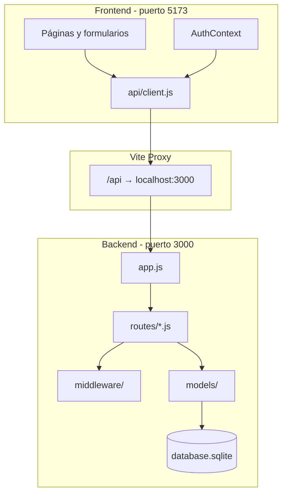

---

## 2. Flujo de datos: frontend → backend

### 2.1 Capa HTTP del frontend

Todas las llamadas pasan por una única instancia de Axios:

**Archivo:** `CNEISI-APP-FRONTEND/src/api/client.js`

- `baseURL`: `/api` (en dev, Vite lo redirige al backend)
- **Interceptor de request:** adjunta `Authorization: Bearer <token>` si existe en `localStorage`
- **Interceptor de response:** convierte errores HTTP en `Error` con el mensaje del servidor

### 2.2 Patrón de captura y envío

No hay capa de servicios por recurso. El flujo estándar es:

```
Formulario (useState) → onSubmit → api.get/post/put/delete → Backend
```

**Excepción:** login y registro pasan por `AuthContext` porque además persisten la sesión (JWT + usuario en `localStorage`).

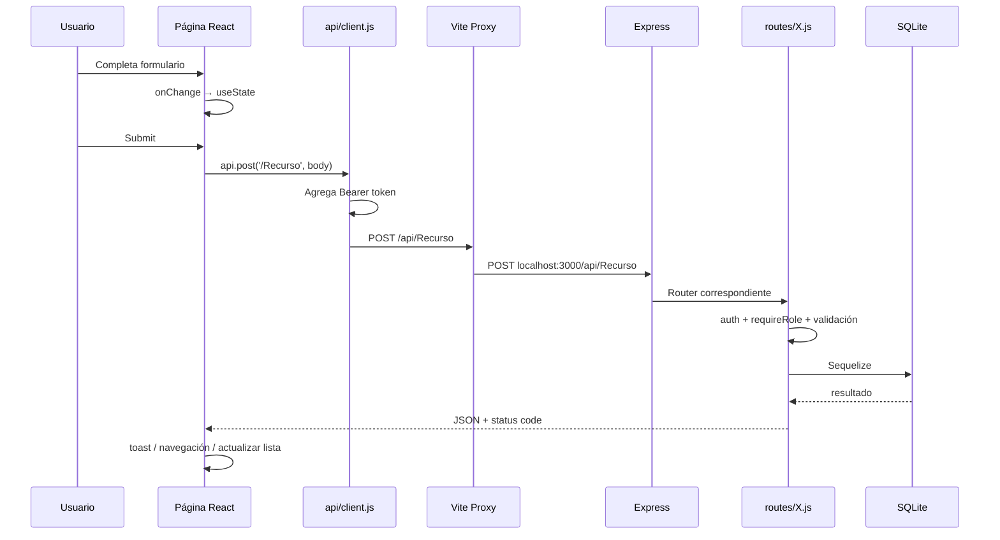

### 2.3 Mapa de llamadas por pantalla

| Pantalla | Operaciones | Endpoint |
|----------|-------------|----------|
| Login | POST | `/api/Authentications` |
| Register | POST | `/api/Usuarios` |
| Timeline | GET, POST | `/api/Eventos`, `/api/Inscripciones` |
| Inscriptions | GET, DELETE | `/api/Inscripciones` |
| Scanner | GET, POST | `/api/Eventos`, `/api/Asistencias/*` |
| Whitelist | CRUD | `/api/Whitelist` |
| Admins | CRUD | `/api/Usuarios`, `/api/Usuarios/admin` |
| Activities | GET | `/api/Eventos` |
| ActivityForm | GET, POST, PUT, DELETE | `/api/Eventos/:id` |
| Metrics | GET | `/api/Usuarios`, `/api/Eventos`, `/api/Inscripciones` |

---

## 3. Autenticación y sesión

### 3.1 Login

**Ruta:** `POST /api/Authentications`  
**Archivo:** `CNEISI-APP-BACKEND/routes/Authentications.js`  
**Acceso:** público (sin token)

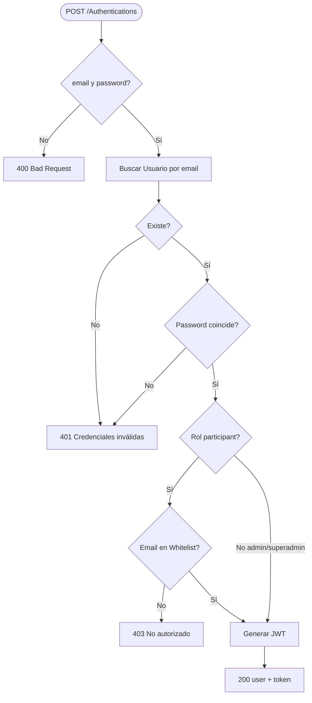

El frontend guarda el token en `localStorage` (`cneisi_token`) y el usuario en `cneisi_auth`.

### 3.2 Middleware de autenticación

**Archivo:** `CNEISI-APP-BACKEND/middleware/auth.js`

1. Lee header `Authorization: Bearer <token>`
2. Verifica JWT con `jsonwebtoken`
3. Adjunta `req.user = { id, email, rol }`
4. Si falla → `401 Token requerido / inválido`

### 3.3 Middleware de roles

**Archivo:** `CNEISI-APP-BACKEND/middleware/requireRole.js`

Factory que recibe roles permitidos: `requireRole('superadmin')`, `requireRole('admin', 'superadmin')`, etc.

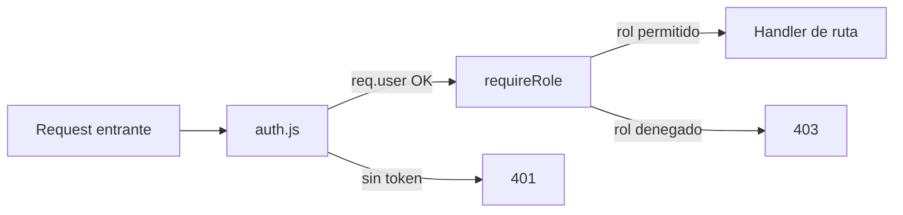

---

## 4. Roles y permisos

### 4.1 Roles del sistema

| Rol | Valor en BD | Descripción |
|-----|-------------|-------------|
| Participante | `participant` | Alumno del congreso |
| Admin | `admin` | Voluntario / escáner |
| Superadmin | `superadmin` | Gestión completa |

### 4.2 Matriz de permisos (backend)

| Recurso | participant | admin | superadmin | Público |
|---------|:-----------:|:-----:|:----------:|:-------:|
| `POST /Authentications` | — | — | — | ✓ |
| `POST /Usuarios` (registro) | — | — | — | ✓ |
| `GET /Eventos` | ✓ | ✓ | ✓ | ✓ |
| `POST/PUT/DELETE /Eventos` | — | — | ✓ | — |
| `GET /Inscripciones` | propias | todas | todas | — |
| `POST /Inscripciones` | ✓ | — | — | — |
| `DELETE /Inscripciones/:id` | propias | — | ✓ | — |
| `GET/POST/PUT/DELETE /Whitelist` | — | — | ✓ | — |
| `GET/PUT/DELETE /Usuarios` | — | — | ✓ | — |
| `POST /Usuarios/admin` | — | — | ✓ | — |
| `POST /Asistencias/*` | — | ✓ | ✓ | — |

### 4.3 Redirección por rol (frontend)

**Archivo:** `CNEISI-APP-FRONTEND/src/utils/routes.js`

| Rol | Ruta inicial |
|-----|--------------|
| `participant` | `/participant` |
| `admin` | `/scanner` |
| `superadmin` | `/management` |

El frontend también valida con `ProtectedRoute`, pero **la seguridad real está en el backend** (JWT + `requireRole`).

---

## 5. Registro y Whitelist

### 5.1 Flujo de registro público

**Ruta:** `POST /api/Usuarios`  
**Archivo:** `CNEISI-APP-BACKEND/routes/Usuarios.js`

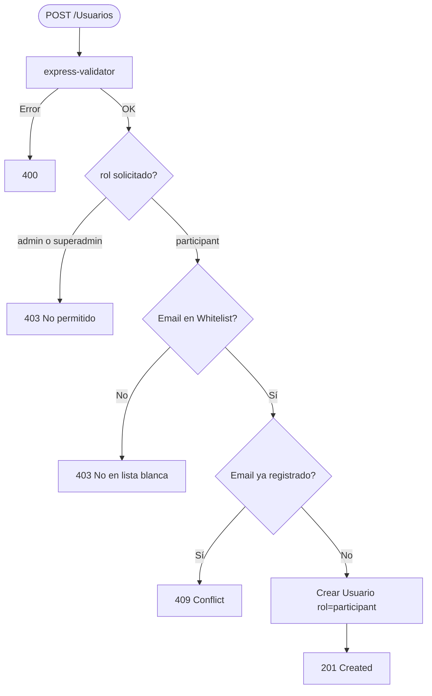

### 5.2 Whitelist

Tabla independiente (`Whitelists`) gestionada solo por superadmin.

- Define qué emails pueden **registrarse** y **loguearse** como participante
- Admin y superadmin **no** necesitan estar en whitelist para autenticarse

---

## 6. Inscripciones

### 6.1 Modelo de datos

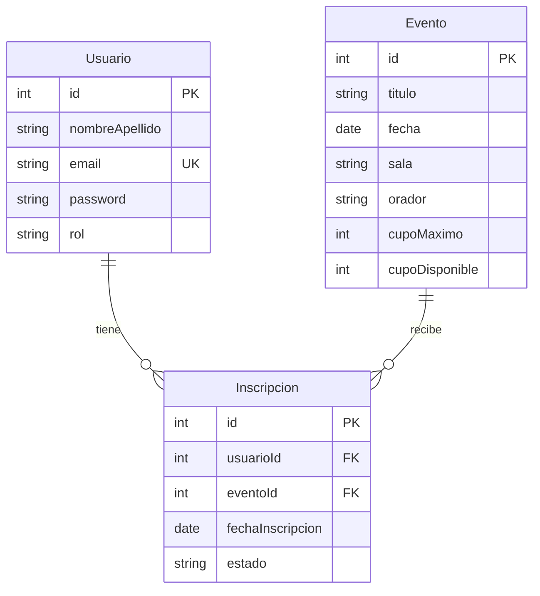

### 6.2 Crear inscripción

**Ruta:** `POST /api/Inscripciones`  
**Rol requerido:** `participant`  
**Archivo:** `CNEISI-APP-BACKEND/routes/Inscripciones.js`

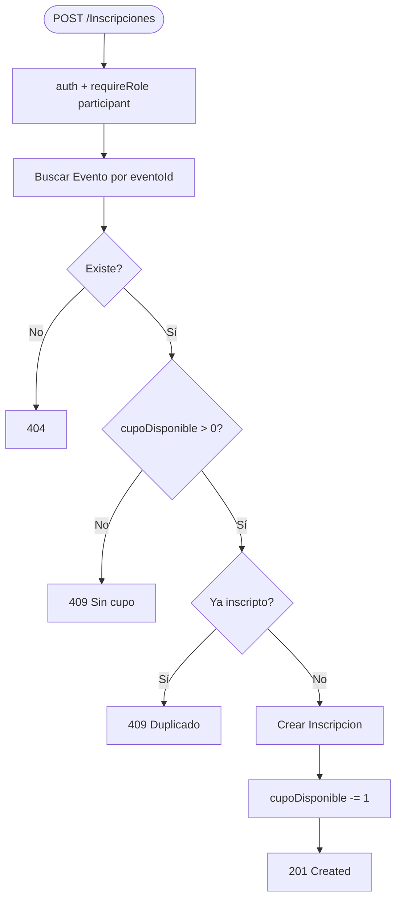

El `usuarioId` se toma de `req.user.id` (JWT), no del body. El participante no puede inscribir a otro usuario.

### 6.3 Cancelar inscripción

**Ruta:** `DELETE /api/Inscripciones/:id`

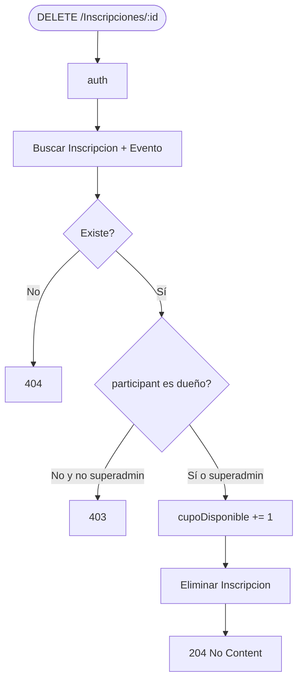

### 6.4 Listar inscripciones

**Ruta:** `GET /api/Inscripciones`

- **Participant:** solo ve las propias (`where: { usuarioId: req.user.id }`)
- **Admin / Superadmin:** ve todas (sin filtro)

---

## 7. Asistencias (registro manual)

### 7.1 Modelo

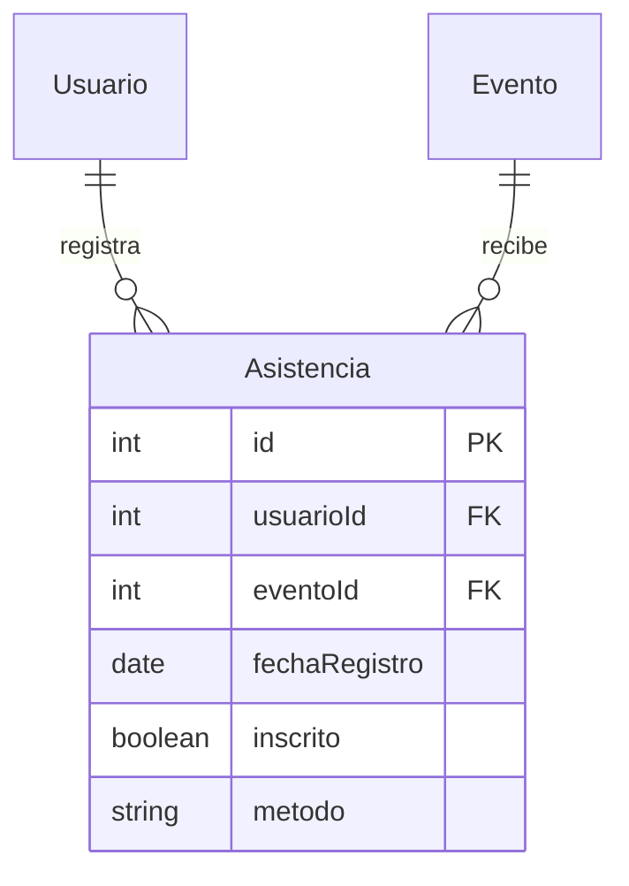

Índice único: `(usuarioId, eventoId)` — un participante solo puede tener una asistencia por actividad.

### 7.2 Validar asistencia

**Ruta:** `POST /api/Asistencias/validar`  
**Rol:** `admin` o `superadmin`

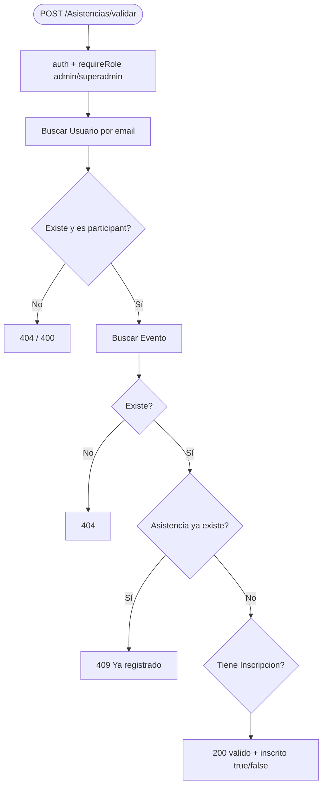

### 7.3 Registrar asistencia manual

**Ruta:** `POST /api/Asistencias/manual`

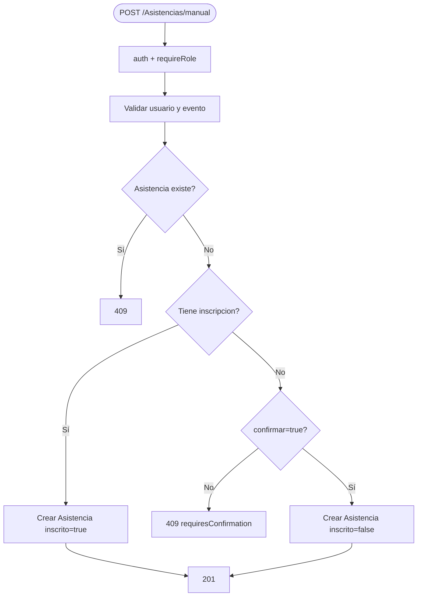

---

## 8. Eventos (actividades)

| Método | Ruta | Auth | Rol |
|--------|------|------|-----|
| GET | `/api/Eventos` | No | Público |
| GET | `/api/Eventos/:id` | No | Público |
| POST | `/api/Eventos` | Sí | superadmin |
| PUT | `/api/Eventos/:id` | Sí | superadmin |
| DELETE | `/api/Eventos/:id` | Sí | superadmin |

El cronograma es público para que cualquiera pueda ver charlas; solo el superadmin puede crearlas o editarlas.

---

## 9. Estructura del backend

```
CNEISI-APP-BACKEND/
├── app.js                 # Entry point, monta routers
├── seed.js                # Datos de prueba
├── models/
│   ├── index.js           # Sequelize + asociaciones
│   ├── Usuario.js
│   ├── Evento.js
│   ├── Inscripcion.js
│   ├── Whitelist.js
│   └── Asistencia.js
├── routes/
│   ├── Authentications.js
│   ├── Usuarios.js
│   ├── Eventos.js
│   ├── Inscripciones.js
│   ├── Whitelist.js
│   └── Asistencias.js
├── middleware/
│   ├── auth.js            # Verifica JWT
│   ├── requireRole.js     # Control por rol
│   └── validate.js        # express-validator helper
└── utils/
    └── auth.js            # signToken, verifyToken, normalizeRole
```

### 9.1 Pipeline de una request protegida

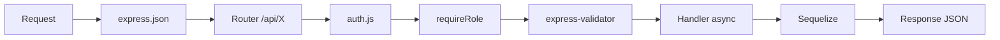

---

## 10. Estructura del frontend

```
CNEISI-APP-FRONTEND/src/
├── api/client.js          # Axios + interceptores
├── context/
│   ├── auth-context.js    # Context vacío
│   └── AuthContext.jsx    # login, register, logout
├── hooks/useAuth.js       # Hook de sesión
├── routes/
│   ├── AppRoutes.jsx      # Rutas por rol
│   └── ProtectedRoute.jsx # Guard de autenticación
├── pages/
│   ├── login.jsx, register.jsx
│   ├── participant/       # Home, Timeline, Inscriptions
│   ├── management/        # Whitelist, Admins, Activities, Metrics
│   └── ScannerPage.jsx    # Asistencia manual
├── components/
│   ├── layout/            # ParticipantLayout, ManagementLayout
│   └── ui/                # PageShell, Toast, ConfirmDialog
└── utils/
    ├── roleUtils.js
    ├── eventUtils.js
    └── routes.js
```

### 10.1 Ejemplo: formulario con componente hijo

En actividades, la UI del form está separada de la lógica HTTP:

```
ActivityFormPage (estado + api calls)
    └── TalkForm (solo inputs, onChange, onSubmit)
```

`TalkForm` no llama al backend. La página padre transforma el form con `buildEventPayload()` y hace `api.post/put`.

---

## 11. Base de datos

- **Motor:** SQLite
- **Archivo:** `database.sqlite` en la raíz del repositorio
- **ORM:** Sequelize con `sequelize.sync()` al arrancar
- **Seed:** `npm run seed` en `CNEISI-APP-BACKEND` (recrea datos de prueba)

### Tablas

| Tabla | Descripción |
|-------|-------------|
| `Usuarios` | Cuentas con rol |
| `Whitelists` | Emails habilitados para participantes |
| `Eventos` | Charlas y talleres |
| `Inscripciones` | Reservas de participantes a eventos |
| `Asistencias` | Registro de asistencia presencial |

---

## 12. Diagrama de flujo completo por rol

```mermaid
flowchart TB
    subgraph public [Acceso público]
        Welcome[/welcome]
        Login[/login]
        Register[/register]
    end

    subgraph auth [Autenticación]
        AuthAPI[POST /Authentications]
        RegAPI[POST /Usuarios]
    end

    subgraph participant [Rol: participant]
        PHome[/participant]
        PTimeline[/participant/timeline]
        PInsc[/participant/inscriptions]
        InscAPI[POST/DELETE /Inscripciones]
    end

    subgraph admin [Rol: admin]
        Scanner[/scanner]
        AsistAPI[POST /Asistencias/*]
    end

    subgraph superadmin [Rol: superadmin]
        Mgmt[/management/*]
        WLAPI[CRUD /Whitelist]
        UserAPI[CRUD /Usuarios]
        EventAPI[CRUD /Eventos]
    end

    Login --> AuthAPI
    Register --> RegAPI
    AuthAPI -->|participant| PHome
    AuthAPI -->|admin| Scanner
    AuthAPI -->|superadmin| Mgmt

    PTimeline --> InscAPI
    PInsc --> InscAPI
    Scanner --> AsistAPI
    Mgmt --> WLAPI
    Mgmt --> UserAPI
    Mgmt --> EventAPI
```

---

## 13. Referencias rápidas

| Necesito entender... | Archivo |
|---------------------|---------|
| Montaje de rutas API | `CNEISI-APP-BACKEND/app.js` |
| Login y JWT | `routes/Authentications.js`, `utils/auth.js` |
| Permisos por rol | `middleware/requireRole.js` |
| Registro + whitelist | `routes/Usuarios.js` |
| Inscripciones y cupos | `routes/Inscripciones.js` |
| Asistencia manual | `routes/Asistencias.js` |
| Cliente HTTP frontend | `CNEISI-APP-FRONTEND/src/api/client.js` |
| Rutas de la UI | `CNEISI-APP-FRONTEND/src/routes/AppRoutes.jsx` |
